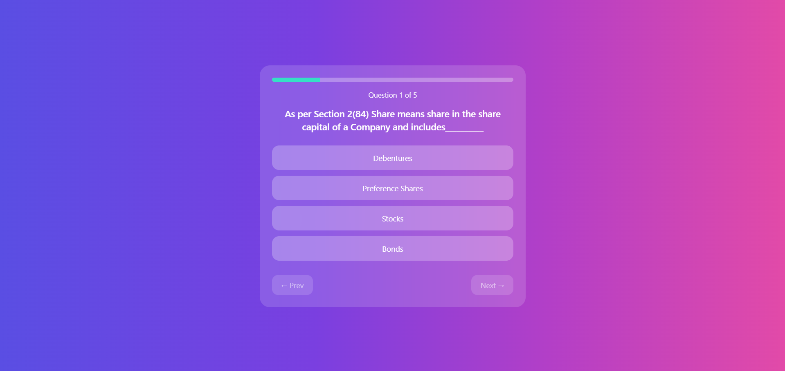
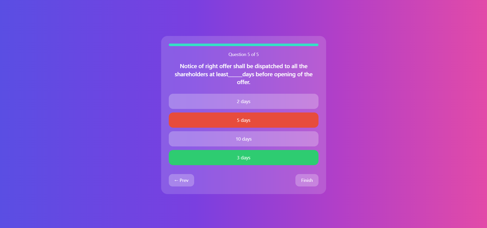
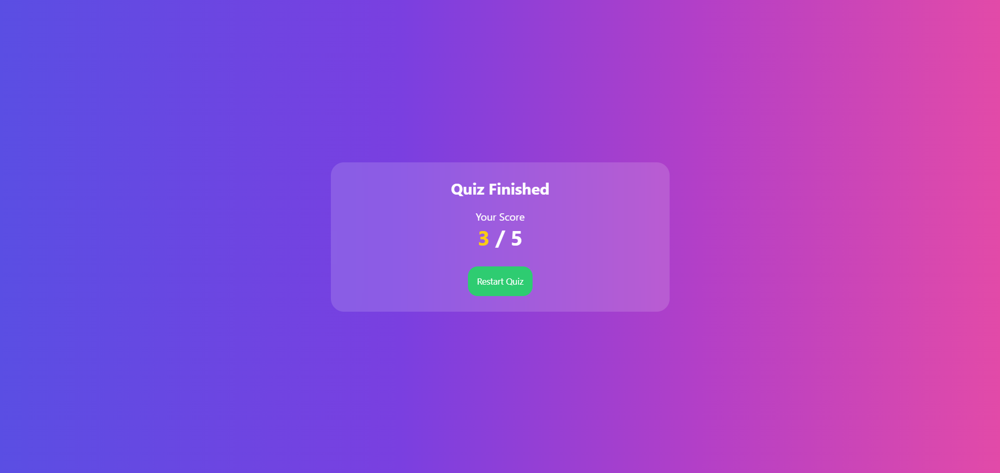

# 📝 React Quiz App

A simple and interactive **Quiz Application** built using **React**.  
This app allows users to answer multiple-choice questions, track their progress, view results, and restart the quiz once completed.

---

## 📸 Screenshot





---

## 🚀 Features

- 📊 Progress bar showing quiz completion
- ✅ Instant answer validation (correct / wrong)
- ⏭️ Next & Previous question navigation
- 🧮 Final score display
- 🔄 Restart quiz option
- 🎨 Modern glassmorphism UI with gradient background
- 🔒 Prevents changing answers after selection

---

## 🛠️ Built With

- ⚛️ **React** (Functional Components & Hooks)
- ⚡ **Vite**
- 🟨 **JavaScript (ES6+)**
- 🎨 **CSS** (Custom styling)

---

## ⚙️ Installation & Setup

```bash
# 1️⃣ Clone the repository
git clone <your-repo-url>

# 2️⃣ Navigate to the project directory
cd react-quiz-app

# 3️⃣ Install dependencies
npm install

# 4️⃣ Run the development server
npm run dev

🌐 **Open your browser and visit:**  
👉 http://localhost:5173

```

## 🧠 How the App Works

- 📦 Quiz questions are stored in an array inside `App.jsx`
- ⚛️ React `useState` manages quiz flow and score
- 🖱️ Users can select only one option per question
- ✅ Answers are validated instantly
- 🧮 Score updates automatically
- 🏁 Result screen appears after the final question

---

## ✨ Future Enhancements

- ⏱️ Add a timer for each question
- 🔀 Shuffle questions and options
- 💾 Save scores using Local Storage
- 🗂️ Add multiple quizzes & categories
- 📱 Improve mobile responsiveness

---

## 📄 License

📌 **Open Source Project**

This project is open-source and free to use for **learning**, **practice**, and **educational purposes**.

Feel free to **fork**, **modify**, and **enhance** it 🚀
